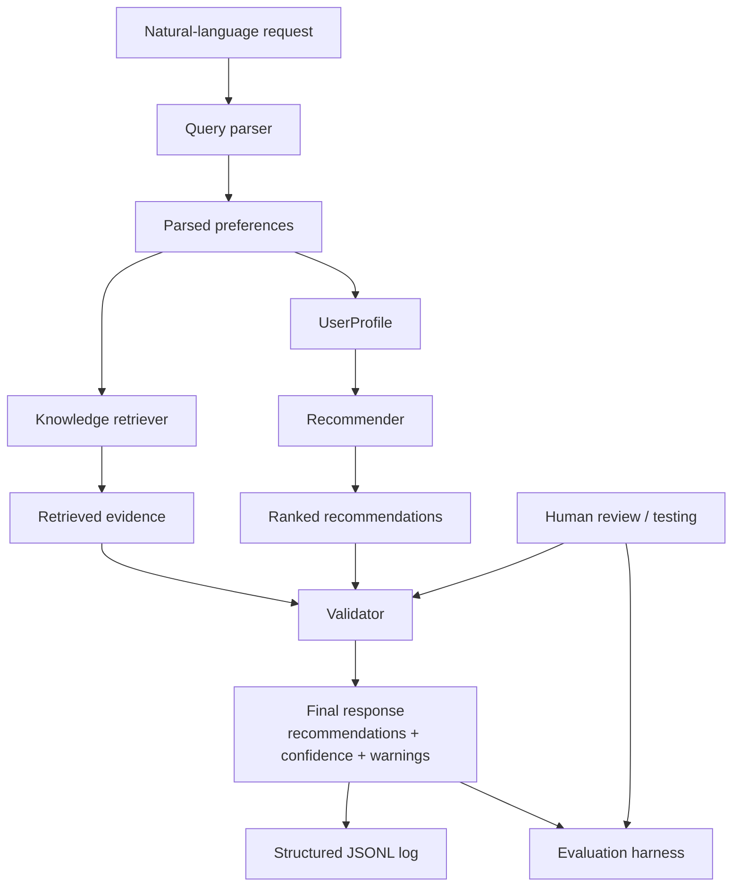

# VibeFinder: Retrieval-Aware Music Recommendation Assistant

## Original Project

This repository began as **Music Recommender Simulation**, a small content-based music recommender from an earlier CodePath AI-110 module. The original version accepted a structured user taste profile, scored songs with simple feature matching, and returned top recommendations with plain-English explanations. Its main goal was to make recommendation logic easy to inspect, test, and discuss.

## Final System Summary

VibeFinder is now a retrieval-aware music recommendation assistant that accepts natural-language requests, parses them into structured preferences, retrieves local knowledge before ranking songs, validates the top result, and logs each run. The system is designed to be deterministic, explainable, and portfolio-friendly: every stage uses explicit heuristics, every recommendation includes reasons, and low-confidence or contradictory cases surface warnings instead of overclaiming.

## Why This Project Matters

This project demonstrates how a small recommender can be extended into an applied AI system without depending on external APIs or black-box generation. It combines rule-based language parsing, local retrieval, feature-based recommendation, confidence scoring, structured logging, and automated evaluation in one end-to-end workflow.

## Architecture Overview

The current baseline recommender is class-based and lives in `src/recommender.py`. It scores songs using heuristics across genre, mood, energy, tempo, valence, danceability, and acousticness. The surrounding applied AI pipeline adds parsing, retrieval, validation, logging, and evaluation around that core ranking engine.



### Main Components

- `src/query_parser.py`: converts user requests into structured preferences and assumptions.
- `src/retriever.py`: retrieves short supporting snippets from the local `knowledge/` folder.
- `src/recommender.py`: class-based scoring and ranking engine over `Song` objects.
- `src/validator.py`: computes confidence, warnings, and validation notes.
- `src/main.py`: runs the full assistant pipeline from request to output.
- `src/eval.py`: runs predefined evaluation cases and prints a pass/fail summary.
- `knowledge/`: local retrieval corpus for genres, moods, listening contexts, acousticness, and feature signals.
- `logs/runs.jsonl`: structured run logs for assistant outputs.

## How It Works

1. A user enters a request such as `I want acoustic lofi songs for studying`.
2. The parser extracts fields like genre, mood, target energy, acoustic preference, and avoid constraints.
3. The retriever looks up relevant local knowledge from short markdown notes.
4. The recommender ranks songs using the parsed preferences and the class-based scoring heuristics.
5. The validator assigns a confidence score and warns on contradictions, missing coverage, or weak fit.
6. The system prints recommendations, evidence, confidence, and warnings, then writes the run to `logs/runs.jsonl`.

## Setup

### 1. Create and activate a virtual environment

```bash
python -m venv .venv
source .venv/bin/activate
```

### 2. Install dependencies

```bash
pip install -r requirements.txt
```

### 3. Run the assistant

```bash
python -m src.main
```

If you do not provide a query, the app runs a small set of predefined demo requests.

### 4. Run the test suite

```bash
python -m pytest -q
```

### 5. Run the evaluation harness

```bash
python -m src.eval
```

## Sample Interactions

These examples are based on the current CLI behavior.

### Example 1: Strong fit

Input:

```text
I want acoustic lofi songs for studying
```

Output highlights:

```text
Parsed Preferences: {'favorite_genre': 'lofi', 'favorite_mood': 'focused', 'target_energy': 0.4, 'likes_acoustic': True, 'avoid_constraints': []}
Top recommendation: Focus Flow by LoRoom
Confidence: 0.99
Warnings: None
```

Why it works:

- The query parser recognizes `lofi`, study-related focus language, low energy, and an acoustic preference.
- The retriever surfaces lofi, studying, and feature-signal notes from the local corpus.
- The validator reports a high-confidence match because the top result aligns strongly across genre, mood, energy, and acousticness.

### Example 2: Strong fit with high energy

Input:

```text
Give me high-energy rock for the gym
```

Output highlights:

```text
Parsed Preferences: {'favorite_genre': 'rock', 'favorite_mood': 'intense', 'target_energy': 0.9, 'likes_acoustic': None, 'avoid_constraints': []}
Top recommendation: Storm Runner by Voltline
Confidence: 0.99
Warnings: None
```

Why it works:

- The parser infers a rock + intense + high-energy request.
- The retriever emphasizes feature-signal notes about tempo and energy.
- The recommender finds a strong catalog match and the validator confirms a high-confidence result.

### Example 3: Contradictory request

Input:

```text
I want ambient songs with very high energy and acoustic feel
```

Output highlights:

```text
Top recommendation: Spacewalk Thoughts by Orbit Bloom
Confidence: 0.36
Warnings:
- The request contains a likely contradiction between genre expectations and target energy.
- Top recommendation is only a weak fit on supporting features like energy, tempo, valence, danceability, or acousticness.
```

Why it matters:

- The system still returns the closest available match.
- It does not pretend the match is strong.
- The validator explicitly flags why the request is difficult to satisfy with the current catalog.

## Design Decisions and Tradeoffs

### 1. Deterministic pipeline over external LLM calls

I kept the system local and deterministic so it remains easy to test, explain, and run reproducibly. That makes the project more transparent and more stable for a classroom and portfolio setting, even though it is less flexible than a model-backed assistant.

### 2. Class-based recommendation engine

The recommendation logic is centralized in `Recommender`, which avoids splitting behavior across multiple parallel APIs. This reduces drift and makes it easier to test and extend the scoring logic in one place.

### 3. Retrieval from local knowledge instead of web sources

The retriever reads short markdown notes from `knowledge/` rather than calling outside systems. That keeps the evidence explainable and lets the retrieval layer change the assistant's behavior without adding network dependencies.

### 4. Confidence and warnings instead of overclaiming

The validator lowers confidence when the catalog lacks genre coverage, when a request is contradictory, or when the top match is weak on supporting features. This choice favors honesty and guardrails over forcing a confident answer in every case.

## Testing Summary

The project includes unit and integration coverage for parsing, retrieval, recommendation, validation, logging, evaluation, and the end-to-end assistant pipeline.

Current validation commands:

```bash
python -m pytest -q
python -m src.main
python -m src.eval
```

Current results:

- `python -m pytest -q`: 24 tests passing.
- `python -m src.eval`: 9 out of 9 evaluation cases passing.
- Average confidence across evaluation prompts: `0.80`.
- Common warning types observed in evaluation:
    - missing catalog coverage
    - contradictory genre/energy request
    - weak supporting-feature fit

## Guardrails and Reliability

- The assistant logs each run to `logs/runs.jsonl`.
- It returns structured warnings when a request is contradictory or weakly supported by the catalog.
- It uses confidence scoring instead of implying every recommendation is equally trustworthy.
- It keeps the retrieval corpus local and inspectable.

## Limitations

- The catalog is still very small, so some genres have only one representative track.
- Retrieval uses simple token overlap rather than deeper semantic search.
- The parser is rule-based, which keeps it transparent but also limits its language flexibility.
- Confidence is heuristic, not learned from real user feedback.
- The system recommends songs from a fixed local dataset rather than a live music library.

## Reflection

The most useful lesson from this project was that “AI system” does not have to mean an opaque model call. A relatively small recommender became much more credible once it could interpret natural language, retrieve supporting local evidence, validate its own result, and surface confidence and warnings. The largest design challenge was keeping those pieces integrated without duplicating logic or creating one-off scoring paths just for testing or evaluation.

This project also reinforced how important it is to make uncertainty visible. The strongest demo moments are not the easy wins like `lofi for studying`; they are the low-confidence cases where the system explains why the catalog or the request makes the answer less trustworthy.

## Loom Walkthrough

Loom video link: `ADD-LOOM-LINK-HERE`

## Repository Structure

```text
src/
    main.py
    query_parser.py
    recommender.py
    retriever.py
    validator.py
    eval.py
knowledge/
logs/
data/
tests/
```

